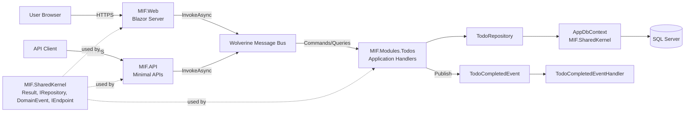

# MIF Architecture

## Overview
This project follows **Vertical Slice Architecture** to organize code by features rather than technical layers. Each feature (module) is self-contained with its own domain logic, application logic, and infrastructure, promoting high cohesion and low coupling.

## Architecture Diagram



## Key Architectural Patterns
- **Vertical Slice Architecture**: Code organized by features/modules, not technical layers.
- **CQRS (Command Query Responsibility Segregation)**: Operations split into **Commands** (writes) and **Queries** (reads) using **Wolverine**.
- **Domain Events**: Commands can publish events (e.g., todo completion) for decoupled side effects.
- **Repository Pattern**: Abstraction layer for data access within each module.
- **Shared Kernel**: Common abstractions and base classes shared across modules.

## Project Structure

### 1. SharedKernel (`MIF.SharedKernel`)
*Common Abstractions.*
- Contains shared interfaces, base classes, and utilities used across all modules.
- **Dependencies**: None (except EF Core for data layer).
- **Key Components**: 
  - `IRepository<T>`: Generic repository interface
  - `Result<T>`: Result pattern for error handling
  - `PaginatedList<T>`: Pagination utility
  - `DomainEvent`: Base class for domain events
  - `AppDbContext`: Shared EF Core context that auto-discovers module configurations
  - `IEndpoint`: Interface for minimal API endpoint registration

### 2. Modules (`MIF.Modules.*`)
*Feature Modules (Vertical Slices).*
- Each module is self-contained with Domain, Application, Infrastructure, and Endpoints.
- **Dependencies**: `MIF.SharedKernel` only.
- **Data Modeling**: Database-first, scaffold-first workflow. Schema-owned fields live in `*.Scaffolded.cs` files.
- **Example: Todos Module (`MIF.Modules.Todos`)**:
  - `Domain/`: Entities specific to Todos (e.g., `TodoItem`)
  - `Application/`: Commands, Queries, DTOs, Validators, and Wolverine message handlers
  - `Application/Events`: Domain events and Wolverine event handlers (e.g., `TodoCompletedEvent`)
  - `Infrastructure/`: Repository implementations and EF Core configurations
  - `Endpoints/`: API endpoint definitions (implements `IEndpoint`)
  - `DependencyInjection.cs`: Module registration

### 3. API (`MIF.API`)
*RESTful API Application.*
- The REST API entry point using Minimal APIs.
- **Dependencies**: `MIF.SharedKernel`, Feature Modules (e.g., `MIF.Modules.Todos`).
- **Key Components**:
  - **Minimal APIs**: Endpoint registration via `IEndpoint` interface
  - **OpenAPI**: API documentation with Scalar
  - **Database**: Configures `AppDbContext` with SQL Server
  - **Wolverine**: Message bus for CQRS with FluentValidation middleware
  - **Module Registration**: Auto-discovers and registers module endpoints

### 4. Web (`MIF.Web`)
*Blazor Server Application.*
- The interactive web UI entry point.
- **Dependencies**: `MIF.SharedKernel`, Feature Modules (e.g., `MIF.Modules.Todos`).
- **Key Components**:
  - **Blazor Server**: Interactive UI components
  - **MudBlazor**: Component library for styling
  - **Okta OIDC**: Cookie + OpenID Connect authentication
  - **Module Registration**: Registers modules via `AddTodosModule()`

## Technologies Stack
- **Framework**: .NET 10.0
- **UI**: Blazor Server with MudBlazor component library
- **API**: Minimal APIs with OpenAPI/Scalar documentation
- **Database**: SQL Server / Azure SQL Edge (via Entity Framework Core)
- **Messaging & CQRS**: Wolverine (with FluentValidation middleware)
- **Validation**: FluentValidation
- **Authentication**: Okta (OpenID Connect)
- **Observability**: Azure Monitor OpenTelemetry (distro) for logs, traces, and metrics
  - **Local Development**: Console logging (no Azure dependencies)
  - **Test/Staging/Production**: Full telemetry to Azure Application Insights
  - **Package**: Azure.Monitor.OpenTelemetry.AspNetCore 1.3.0

## Getting Started

### Prerequisites
- .NET 10.0 SDK
- SQL Server or Azure SQL Edge (Docker recommended for local dev)

### Running the Application

**API:**
```bash
dotnet run --project src/MIF.API/MIF.API.csproj
```
Access the API at the URL printed on startup and view the API documentation at `/scalar/v1`.

**Web UI:**
```bash
dotnet run --project src/MIF.Web/MIF.Web.csproj
```

### Running Tests
```bash
dotnet test
```

### Database Workflow

- Schema changes are applied in SQL Server first.
- Then update module scaffolded EF model shape (`*.Scaffolded.cs`) and mapping configuration.
- Keep custom business behavior in non-scaffold partial files.

## Module Development Guide

### Adding a New Module
1. Create a new project: `MIF.Modules.[YourModule]`
2. Add reference to `MIF.SharedKernel`
3. Create the following structure:
   - `Domain/`: Entity models
   - `Application/`: Commands, queries, validators, and handlers
   - `Infrastructure/`: Repository implementations and EF configurations
   - `Endpoints/`: API endpoints (implement `IEndpoint`)
   - `DependencyInjection.cs`: Module service registration

4. Register the module in `MIF.API` and `MIF.Web`:
   ```csharp
   builder.Services.Add[YourModule]Module();
   builder.Host.UseWolverine(opts =>
   {
       opts.Discovery.IncludeAssembly(typeof([YourModule].DependencyInjection).Assembly);
   });
   ```

### Creating Commands and Queries
Use Wolverine's message handlers:

**Command:**
```csharp
public record CreateTodoCommand(string Title, string Description);

public static class CreateTodoHandler
{
    public static async Task<Result<int>> Handle(CreateTodoCommand command, ITodoRepository repository)
    {
        // Handle command
    }
}
```

**Query:**
```csharp
public record GetTodoQuery(int Id);

public static class GetTodoHandler
{
    public static async Task<Result<TodoDto>> Handle(GetTodoQuery query, ITodoRepository repository)
    {
        // Handle query
    }
}
```

### Creating Endpoints
Implement `IEndpoint` for automatic registration:
```csharp
public class TodoEndpoints : IEndpoint
{
    public void MapEndpoint(IEndpointRouteBuilder endpoints)
    {
        endpoints.MapGet("/api/todos", async (IMessageBus bus) =>
        {
            var result = await bus.InvokeAsync<Result<List<TodoDto>>>(new GetTodosQuery());
            return result.IsSuccess ? Results.Ok(result.Value) : Results.BadRequest(result.Error);
        });
    }
}
```
